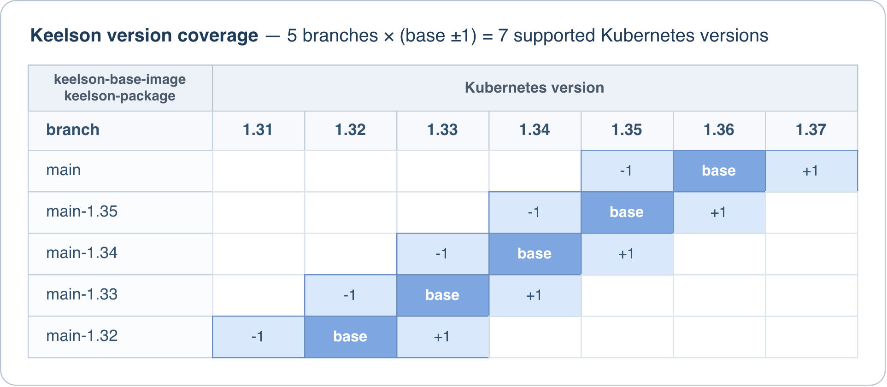

# Keelson

A Kubernetes image-update controller. Watches annotated workloads, queries
registries for newer tags, patches the workload when a newer tag meets the
configured policy.


# Naming

Keelson is the part of a boat directly above and on top of the [keel](https://keel.sh).


# Origin

Keelson was born while working with an AKS cluster that had cluster-wide pull
permissions and no imagePullSecrets specified. The logging, the documentation,
and the community support were all weak. When faced with a time pressure and a
desire to do things right and leave the customer with a great system, this was
not ideal. The final thing lacking in Keel was job support, this [open ticket](https://github.com/keel-hq/keel/issues/352)
illustrates the issue. No progress in over 7 years since the ticket was opened.


# Using Keelson

Keelson can be consumed into your clusters in a number of ways, some of which
are detailed below.


## Kubernetes Version Support

Keelson scripts are Kubernetes version agnostic for most intents and purposes.
The scripts are released and versioned in this project, then consumed in the
`keelson-package` project in a series of branches, one for each Kubernetes
version. Keelson image versions are self-explanatory once you know the pattern:

```
# Parts
[Keelson version][Kube major.minor][package patch]
# Format
1.X.1.Y.Z
# Example
1.20.1.36.1
```

Where:

* X is the latest Keelson minor from [releases](https://github.com/keelson-pro/keelson/releases).
* Y is your cluster's Kubernetes minor, plus or minus one, matching kubectl's +/-1 support window.
* Z is a per-release patch starting at 1 for a given combination of Keelson and kube support.

Use the following table to understand this versioning scheme:



Each branch (`main`, `main-1.35`, `main-1.34`, and so on) builds against its
own base image line and produces images in its matching Kube version series.
The `main` branch supports whatever the latest available Kubernetes version is
at any given time with several older Kubernetes version branches maintained in
parallel to support stragglers. The table may fall behind package availability,
but the scheme extends unchanged into future versions.


## Kaptain

For Kaptain users, just add a one-line entry in your platform product or
`run-platform-*` meta environment, PR, merge, and roll out as needed.

Take the newest `keelson-package` version with the Kubernetes version that
matches your cluster, plus or minus one. The reference will look like this:

```
ghcr.io/keelson-pro/keelson/keelson-package:[1.X.1.Y.Z]
```

Where X, Y, and Z are as explained further up in this document. Available
versions can be browsed on the [`keelson-package` release page](https://github.com/keelson-pro/keelson-package/releases).


## Helm

A [Helm chart](https://github.com/keelson-pro/keelson-helm-chart) consumes the
`keelson` manifests and defaults, converts them to Helm templates and enforces
repo state. The only required value is `image.tag`, the `keelson-package`
version chosen above; it has no default for the reason given in the Helm chart
repo. Note that using a [`keelson-package` version](https://github.com/keelson-pro/keelson-package/tags)
that does not match the manifests in the Helm chart could cause it to fail on
startup. But if the image does match, then it should work as well as any other
deployment method.


## Raw Apply

If you deploy manually or use some kind of custom scripted push model from some
form of CI server, then you can convert the manifests into plain fully-formed
final manifests ready for direct application in one of two ways. Both examples
below use `cluster-infra` as the namespace, change it as needed.

1. Helm render from included default values file plus overrides:

```
helm repo add keelson https://keelson-pro.github.io/keelson-helm-chart
helm repo update
helm template keelson keelson/keelson --namespace cluster-infra --set image.tag=1.20.1.36.1 --output-dir rendered
kubectl apply --server-side --field-manager="yourFieldManager" -R -f rendered
```

2. Download the zips for a `keelson-package` version and combine:

```
mkdir keelson-1.20 && cd keelson-1.20
curl -sSLo manifests.zip https://github.com/keelson-pro/keelson-package/releases/download/1.20.1.36.1/keelson-package-1.20.1.36.1-manifests.zip
curl -sSLo contract.zip https://github.com/keelson-pro/keelson-package/releases/download/1.20.1.36.1/keelson-package-1.20.1.36.1-contract.zip
unzip manifests.zip && unzip contract.zip
echo -n "cluster-infra" > defaults/Environment
echo -n "platform-set" > defaults/ProductName
echo -n "example.com/my-company/my-team" > defaults/Keelson/EnvironmentDockerRegistryAndNamespace # Omit for ghcr public, or replace with your registry and namespace
echo -n "mynexusinstance.com" > defaults/Keelson/EnvironmentDockerRegistry # The registry the AuthMode below applies to
echo -n "aws-irsa" > defaults/Keelson/AuthMode # or `gcp-wi` or `azure-wi` or `secret`
for manifest in keelson-package/*.yaml; do
  content=$(<"$manifest")
  while IFS= read -r file; do
    token="\${${file#defaults/}}"
    value=$(<"$file")
    content=${content//"$token"/"$value"}
  done < <(find defaults -type f)
  printf '%s\n' "$content" > "$manifest"
done
kubectl apply --server-side --field-manager="yourFieldManager" -R -f keelson-package
```


## Configuration

See [Configuration.md](Configuration.md) for environment variables, the
`registries.yaml` shape and auth modes, the per-workload annotations
Keelson honours, and the logging philosophy and per-level event tables.


## Field ownership

See [FieldManagerOwnership.md](FieldManagerOwnership.md) for how Keelson
interacts with Kubernetes' three field-ownership regimes (plain writes,
client-side apply, Server-Side Apply), the two-tier mimic-or-scoped-write
approach it uses to avoid disturbing the workload's real owner, and how
this differs from Keel.


## Runtime

See [EntryPoints.md](EntryPoints.md) for the five executable scripts in
`src/scripts/` - what calls them, with what arguments, and how they fit
together at runtime.


## Tech stack

Bash, kubectl, yq 4, skopeo. Everything runs in containers. Tests: BATS. Lint: shellcheck.


## Contents

- **Scripts** (`src/scripts`) - bash runtime entry points.
- **Library** (`src/scripts/lib`) - bash scripts sourced by runtime scripts.
- **Manifests** (`src/kubernetes/` and generated) - templated with `${Environment}`.
- **Defaults** (`src/defaults/`) - shipped values that populate the Deployment env so a vanilla install just works.
- **Tests** (`src/tests/`) - the BATS suite covering the library code.


# Ecosystem

Keelson is one of seven related repositories. The diagram below shows how they
feed each other; the [keelson-all](https://github.com/keelson-pro/keelson-all#branchout-repo-management)
README lists each one with a link. Click the image for a full-size view.

[](https://raw.githubusercontent.com/keelson-pro/keelson-all/main/images/keelson-ecosystem.png)


# License

Keelson is MIT licensed except for `*.md` Markdown docs which are CC-BY-SA-4.0
For more detail see [LICENSE.md](https://github.com/keelson-pro/.github/blob/main/LICENSE.md).
